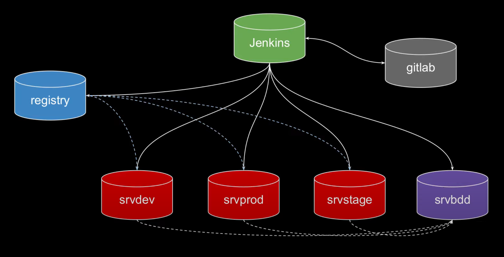

## Déploiement complet d'une application Spring Boot via un pipeline CI/CD sur Jenkins.



### Notes

Ce projet est inspiré par la série "Devenir Devops" de Xavki. L'application a été faite par Callicoder.

+ [Xavki: Devenir Devops](https://gitlab.com/xavki/pipeline-saison-1)

+ [Callicoder: Spring-security-react-ant-design-polls-app](https://github.com/callicoder/spring-security-react-ant-design-polls-app)

## Étapes pour le déploiement de l'application (polling-app)

1. **Clone du repo**

	```bash
	git clone https://github.com/naqa92/spring-boot-jenkins-ci-cd.git
	cd vagrant
	```

2. **Déploiement de l'infrastructure**

	```bash
	vagrant up
	```

3. **Configuration de Gitlab**

	+ Récupération du mot de passe root initial (vagrant ssh gitlab)

	```bash
	cat /etc/gitlab/initial_root_password
	```

	+ Se connecter sur http://192.168.10.10 et modifier le mot de passe root

	+ Créer un autre utilisateur via l'interface admin

	+ Configurer les WebHooks : Settings > Network > Outbound requests puis cocher "Allow webhooks" et ajouter l'ip jenkins (192.168.10.2)

	+ Se connecter avec l'utilisateur et créer un nouveau groupe (MyPipeline, public) 

4. **Mise en place du dépôt**

	```bash
	cd polling-app
	git init
	git add .
	git commit -m "init"
	```

	+ Créer un nouveau projet (polling-app, public) et copier la ligne "git remote" pour établir le lien.

	```bash
	git remote add origin git@gitlab.example.com:mypipeline/polling-app.git
	```

5. **Génération de clé SSH Gitlab**
	
	```bash
	ssh-keygen
	```

	+ Copier le contenu du fichier "id_rsa.pub"

	+ Coller dans SSH Keys : Profile > Preferences > SSH
	* * S'il y a toujours un mot de passe : modifier l'url dans .git/config par git@url (bouton clone bleu)

6. **Push du dépôt et création de branches**

	```bash
	git push -u origin master
	git branch dev
	git checkout dev
	git push -u origin dev
	git branch stage
	git checkout stage
	git push -u origin stage
	```

7. **Configuration de Jenkins**

	+ Récupération du mot de passe root initial (vagrant ssh jenkins)

	```bash
	cat /var/lib/jenkins/secrets/initialAdminPassword
	```

	+ Se connecter sur http://192.168.10.2 et installer les plug-ins suggérés

	+ Installer les plug-ins suivants : Gitlab, Docker Pipeline, Ansible, Jmeter performance (optionnel: job config history)

	+ Authentification : Configuration > Systeme > Décocher l'authentification Gitlab 

	+ Créer un MultiPipeline, et ajouter le repo du projet dans Branch sources > Git (http://gitlab.example.com/mypipeline/polling-app) 

8. **Génération de clé SSH Jenkins**

	+ Copier la clé SSH sur les serveurs suivants : dev, stage, prod et bdd
	
	```bash
	sudo su - jenkins
	ssh-keygen
	ssh-copy-id -i .ssh/id_rsa.pub vagrant@SERVEURCIBLE
	```
9. **Configuration de l'auto-build sur un push**

	+ L'auto-build est réalisé grâce à la partie "properties" du fichier Jenkinsfile

	+ Créer un Project Hook sur Gitlab : Settings > Webhook puis ajouter l'url et le token (disponible dans la configuration de la branche sur jenkins)

	+ Cocher la case "Push Events" et désactiver le SSL

10. **Configuration des Credentials pour la registry Docker**

	+ Configuration Jenkins : Credentials > Global et "Add Credentials"

	+ Indiquer les identifiants définis dans le script lors du déploiement de l'infrastructure (mettre la variable myregistry_login dans ID)

11. **Mise en place CI/CD**

	+ Mettre en place les dépôts pour chaque service : deploy-ansible, service-docker, service-install-run et service-mysql (voir étape 4)

	+ Lancer un build sur la branche dev

	+ Si tout fonctionne, on applique ensuite sur les branches stage et master

	```bash
	git checkout stage
	git merge dev
	git push
	git checkout master
	git merge stage
	git push
	```
	L'application est maintenant accessible sur les liens suivants

	+ http://192.168.10.3:3000/ (dev)

	+ http://192.168.10.7:3000/ (stage)

	+ http://192.168.10.4:3000/ (master)

### Informations supplémentaires

	Ce projet a pour but de mettre en place un pipeline CI/CD dans un environnement local de test.
 	La sécurité n'est pas prise en compte pour des raisons de simplicité.

	Voici une liste non exhaustive d'améliorations :

+ Réseau : Isolation dev/stage/prod par des vlans
+ Jenkins 1 par environnement avec droits SSH exclusifs + slaves
+ BDD 1 par environnement + secure pg_hba/listen + gestion droits sql/users + backup/réplication
+ Serveur de dépot pour installations de package (mirroring)
+ WEB : reverse-proxy, load balancing, mesh
+ Gestion des droits gitlab par groupe
+ Securité (ssl, authentification, check images, rules firewall, vault + encrypted ansible, expositions de ports, versions...)
+ Test sur STAGE avec Jmeter
+ Registry : LDAP
+ domaine public dédié au backend
+ monitoring/logs
+ Automatisation avec le plug-in JCasC
